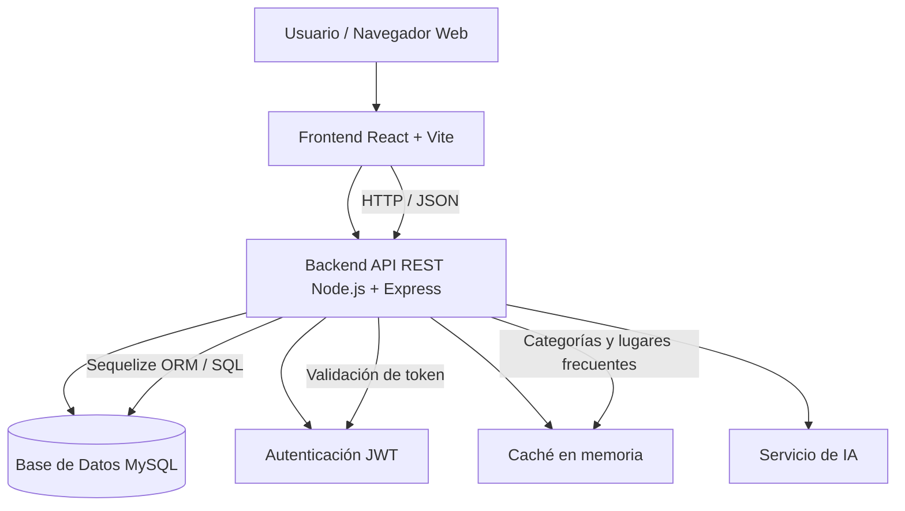

# Arquitectura del Proyecto - TurismoVE

## 1. Descripción general

**TurismoVE** es una aplicación web full-stack orientada a registrar, organizar y promocionar lugares turísticos, experiencias y servicios relacionados con el turismo en Venezuela.

El sistema permite consultar categorías turísticas, explorar lugares, registrar nuevos destinos, manejar autenticación de usuarios y administrar publicaciones desde un panel de control.

## 2. Objetivo de la arquitectura

La arquitectura del proyecto busca separar claramente las responsabilidades entre:

- Frontend: interfaz visual e interacción con el usuario.
- Backend: lógica de negocio, autenticación, autorización, endpoints y seguridad.
- Base de datos: almacenamiento de usuarios, categorías, lugares, reseñas y fotos.
- Servidor: despliegue del backend y exposición de la API.
- Caché: mejora de rendimiento en consultas frecuentes.

## 3. Diagrama general



## 4. Capas del sistema

### 4.1 Frontend

El frontend será desarrollado con **React + Vite**.

Responsabilidades principales:

- Mostrar la interfaz de usuario.
- Consumir la API REST del backend.
- Mostrar categorías turísticas.
- Mostrar lugares turísticos.
- Permitir login y registro.
- Enviar formularios al backend.
- Mostrar vistas públicas y privadas según el rol del usuario.

### 4.2 Backend

El backend está desarrollado con **Node.js + Express**.

Responsabilidades principales:

- Exponer endpoints REST.
- Gestionar autenticación con JWT.
- Gestionar autorización por roles.
- Validar solicitudes.
- Manejar categorías turísticas.
- Manejar lugares turísticos.
- Permitir aprobación o rechazo de lugares desde administración.
- Aplicar caché básico.
- Manejar errores de forma centralizada.

### 4.3 Base de datos

La base de datos actual del backend es **MySQL**, gestionada mediante **Sequelize** y **Sequelize CLI**.

Entidades principales:

- Usuarios.
- Categorías.
- Lugares turísticos.
- Reseñas.
- Fotos.
- Roles.

El backend cuenta con conexión real a base de datos, modelos Sequelize, migraciones y seeders. El archivo `src/data/memory.js` queda como referencia histórica y no representa la fuente principal de datos.

### 4.4 Caché

Se implementa caché básico en memoria para reducir consultas repetidas y mejorar el rendimiento.

Datos cacheados inicialmente:

- Categorías turísticas.
- Listado de lugares aprobados.

Tiempo estimado de caché:

- Categorías: 5 minutos.
- Lugares: 2 minutos.

## 5. Autenticación y autorización

### Autenticación

La autenticación se realiza mediante **JWT**.

Flujo básico:

1. El usuario se registra o inicia sesión.
2. El backend valida las credenciales.
3. El backend genera un token JWT.
4. El frontend usa ese token para acceder a rutas protegidas.

### Autorización

La autorización se maneja por roles.

Roles definidos:

| Rol                | Permisos                                  |
| ------------------ | ----------------------------------------- |
| Visitante          | Consultar categorías y lugares turísticos |
| Usuario registrado | Crear publicaciones turísticas            |
| Administrador      | Aprobar, rechazar y gestionar contenido   |

## 6. Estructura del backend

```txt
backend/
├── src/
│   ├── config/
│   ├── data/
│   ├── middlewares/
│   ├── modules/
│   │   ├── admin/
│   │   ├── auth/
│   │   ├── categories/
│   │   └── places/
│   ├── app.js
│   ├── routes.js
│   └── server.js
├── .env.example
├── package.json
└── README.md
```

## 7. Seguridad inicial

Medidas aplicadas:

- Contraseñas encriptadas con bcrypt.
- Tokens JWT para sesión.
- Middleware para proteger rutas privadas.
- Middleware para validar roles.
- Variables de entorno para configuración sensible.
- CORS configurado para controlar acceso desde el frontend.
- Manejo centralizado de errores.

## 8. Optimización inicial

Optimizaciones implementadas:

- Caché en memoria.
- Paginación en listado de lugares.
- Filtros por categoría.
- Búsqueda por nombre o ubicación.
- Separación modular del código.
- Respuestas JSON claras.
- Rutas públicas y privadas separadas.

## 9. Propuesta de despliegue

La propuesta de deploy es:

| Capa          | Plataforma sugerida                      |
| ------------- | ---------------------------------------- |
| Frontend      | Vercel o Netlify                         |
| Backend       | Render o Railway                         |
| Base de datos | MySQL en AlwaysData, Railway u otro proveedor compatible |

## 10. Conclusión

La arquitectura de TurismoVE cumple con la separación entre frontend y backend, define una API REST modular, incluye autenticación/autorización, aplica caché básico y ya cuenta con conexión a MySQL mediante Sequelize.
